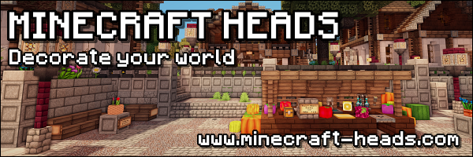

# OpenHeads

**OpenHeads** is a **free and open-source** plugin for Minecraft servers, 
designed to enhance player experience by providing an **intuitive graphical interface (GUI)** for **Browse and obtaining custom decorative heads**. 
Integrate unique aesthetics into your server with ease and expand customization options for your players.

## Key Features

* **Extensive Head Collection:** Access a vast library of custom player heads from `minecraft-heads.com`.
* **User-Friendly GUI:** Navigate effortlessly through categories and preview heads with a clean graphical interface.
* **Seamless Acquisition:** Players can easily select and obtain heads directly through the GUI.
* **Essential Integrations:** Built-in compatibility with **Vault** (for economy features, if implemented) and **ProtocolLib** (for advanced packet handling).
* **Granular Permissions:** Full control over who can access the plugin and its specific features.

## Installation

Getting OpenHeads up and running on your server is straightforward:

1.  **Download:** Obtain the latest stable `.jar` file from the [GitHub Releases page](https://github.com/TavstalDev/OpenHeads/releases).
2.  **Placement:** Move the downloaded `.jar` file into your Minecraft server's `plugins/` directory.
3.  **Restart:** Fully restart your Minecraft server to properly load OpenHeads and its required dependencies.

## Commands

OpenHeads commands are designed for ease of use for both players and administrators. All commands begin with `/heads`.

| Command          | Description                                     | Permissions                                  |
| :--------------- | :---------------------------------------------- | :------------------------------------------- |
| `/heads`         | Opens the main OpenHeads GUI menu.              | `openheads.command.heads` / `openheads.player` |
| `/heads help`    | Displays a list of all available OpenHeads commands and their usage. | `openheads.command.help` / `openheads.player` |
| `/heads version` | Shows the currently installed version of OpenHeads. | `openheads.command.version` / `openheads.player` |
| `/heads reload`  | Reloads the plugin's configuration and data.    | `openheads.command.reload` / `openheads.admin` |

## Permissions

OpenHeads features a robust permission system, allowing server administrators to control access to various functionalities. Permissions are managed through your server's permission plugin (e.g., LuckPerms).

| Permission Node             | Description                                          | Default Access (without permission plugin) |
| :-------------------------- | :--------------------------------------------------- | :--------------------------------------- |
| `openheads.command.heads`   | Allows a player to open the main heads GUI.          | OP                                       |
| `openheads.command.help`    | Allows a player to view the plugin's help messages.  | OP                                       |
| `openheads.command.version` | Allows a player to check the plugin version.         | OP                                       |
| `openheads.command.reload`  | Grants permission to reload the plugin (admin command). | OP                                       |
| `openheads.player`          | A meta-permission node that grants all player-related permissions (e.g., `openheads.command.heads`, `openheads.command.help`, `openheads.command.version`). | None                                     |
| `openheads.admin`           | A meta-permission node that grants all administrative permissions (e.g., `openheads.command.reload`). | None                                     |
| `openheads.*`               | Grants all permissions for the OpenHeads plugin.     | OP                                       |

## Dependencies

To ensure OpenHeads functions correctly, your server must have the following plugins installed:

* **[Vault](https://www.spigotmc.org/resources/vault.34315/)**: Required for general API compatibility. 
* * If you plan to use economy features (e.g., purchasing heads), you will also need an **economy plugin that integrates with Vault** (e.g., EssentialsX, CMI, PlayerPoints).
* **[ProtocolLib](https://www.spigotmc.org/resources/protocollib.1997/)**: Essential for handling custom GUI interactions and advanced packet manipulation.

## Contributing

We welcome contributions! If you have ideas for features, bug fixes, or improvements, please consider contributing to the project.

1.  **Fork** the repository on GitHub.
2.  **Create a new branch** for your feature or bug fix (e.g., `feature/add-category` or `fix/gui-bug`).
3.  **Commit your changes** with clear, concise, and descriptive commit messages.
4.  **Push your branch** to your forked repository.
5.  **Open a Pull Request** to the `main` branch of this repository, describing your changes.

## License

This project is licensed under the **GNU General Public License v3.0**. You can find the full license text in the `LICENSE` file within this repository.

## Contact

For any questions, bug reports, or feature requests, please use the [GitHub issue tracker](https://github.com/TavstalDev/OpenHeads/issues).

## Credits & Disclaimer

> **Important Disclaimer:**
> This plugin utilizes and displays head data sourced from [minecraft-heads.com](https://minecraft-heads.com). We want to clarify that **we do not own, control, or claim intellectual property rights over any content originating from `minecraft-heads.com`**. All credit, rights, and ownership for the custom heads displayed within OpenHeads belong solely to their original creators on the [minecraft-heads.com](https://minecraft-heads.com) website.

